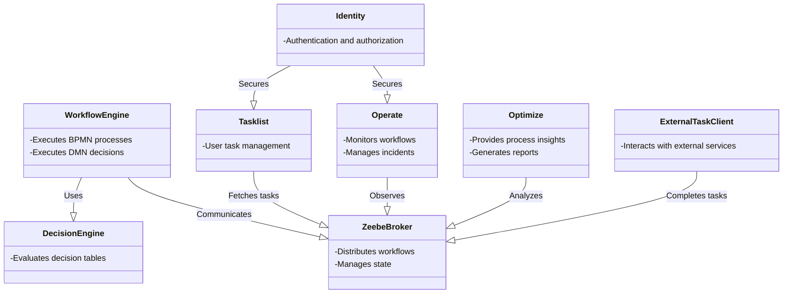
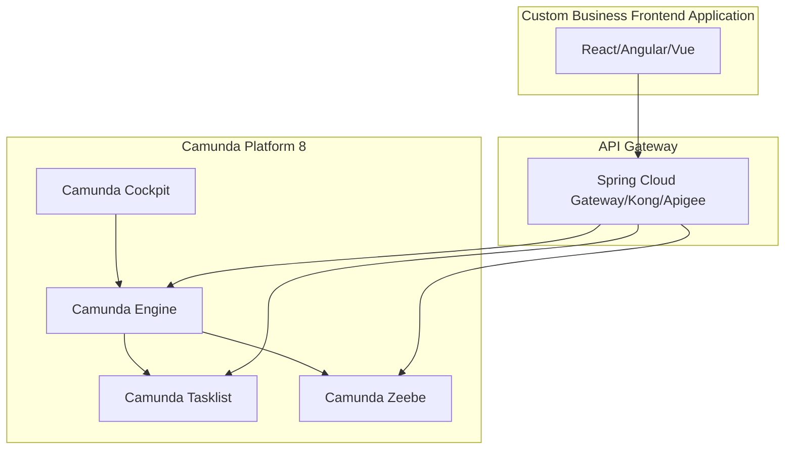
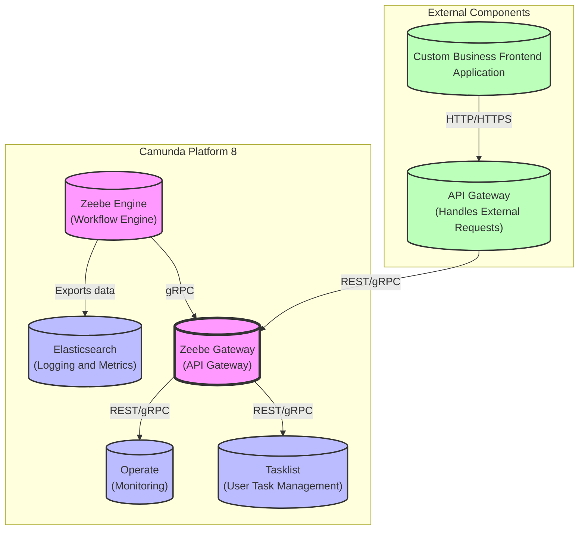

**Zeebe Engine**: The core workflow engine of Camunda Platform 8, responsible for deploying and executing BPMN workflows.

**Operate**: A monitoring tool that provides visibility into deployed workflows and ongoing instances.

**Tasklist**: A user interface for managing and completing user tasks.

**Elasticsearch**: Used for logging and metrics storage, enabling powerful searching capabilities for Operate.

**Zeebe Gateway**: Acts as the API gateway for the Zeebe Engine, facilitating communication between the engine and other components like Operate and Tasklist.

**Custom Business Frontend Application**: Represents an external application that interacts with Camunda Platform 8 through an API Gateway.

**API Gateway (External)**: An external API gateway that routes requests from the Custom Business Frontend Application to the
