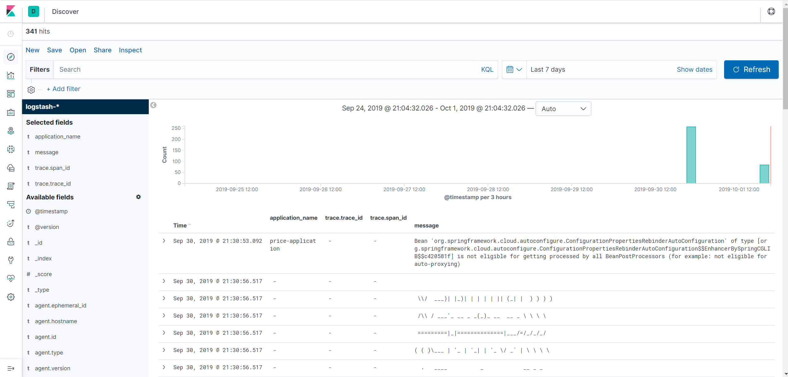
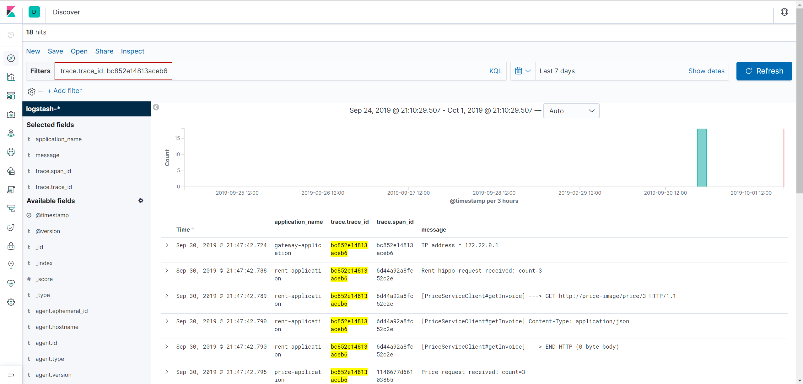

## Сборка логов

### Инструменты

[Централизованное хранение логов](https://microservices.io/patterns/observability/application-logging.html) позволяет легко получить полную информацию об обработке клиентского запроса во всех задействованных в этом процессе микросервисах. [Elastic Stack](https://www.elastic.co/what-is/elk-stack) решает задачу сбора, обработки, хранения, индексации и визуализации логов приложений на базе Spring Boot.

[Elastic Stack](https://www.elastic.co/what-is/elk-stack) – это группа приложений с открытым исходным кодом от Elastic, разработанная для получения данных из любого источника и в любом формате, поиска, анализа и визуализации этих данных в режиме реального времени. Ранее он был известен как ELK Stack, в котором буквы в названии обозначали приложения в группе: Elasticsearch, Logstash и Kibana. Четвертое приложение, Beats, было впоследствии добавлено в стек, что привело к необходимости отказаться от старой аббревиатуры. Таким образом, ELK Stack стал Elastic Stack.

**Elasticsearch** – распределенное хранилище, осуществляющее поиск и анализ данных в реальном времени.

**Kibana** – платформа для анализа и визуализации, разработанная для работы с Elasticsearch. Kibana позволяет проводить
расширенный анализ и визуализацию данных в виде диаграмм, таблиц и карт.

**Beats ** – поставщики данных, которые могут быть установлены в качестве агентов на серверах для отправки оперативных
данных непосредственно в Elasticsearch или через Logstash, где они могут быть дополнительно обработаны и улучшены.
Существует несколько видов Beats для разных целей:

- Filebeat: логи
- Metricbeat: метрики
- Packetbeat: данные сети
- Heartbeat: мониторинг работоспособности
- etc.

**Logstash** – мощный инструмент, который интегрируется с самыми разными системами. Он предлагает большой выбор плагинов, которые помогут вам парсить, обогащать, преобразовывать и буферизовать данные из различных источников. Использование Logstash потребуется в том случае, когда данные требуют дополнительной и недоступной в Beats обработки.

- Filebeat собирает данные из лог-файлов и отправляет их в Logststash
- Logstash преобразовывает данные и отправляет их в Elasticsearch
- Elasticsearch хранит и индексирует данные
- Kibana отображает данные, хранящиеся в Elasticsearch

*docker-compose.yml*

```yaml
filebeat:
    image: elastic/filebeat:8.12.1
    container_name: filebeat
    volumes:		# Конфиг файл
      - ./config/filebeat/filebeat.docker.yml:/usr/share/filebeat/filebeat.yml:ro   
      - /var/lib/docker/containers:/var/lib/docker/containers:ro              # Логи докера
      - /var/run/docker.sock:/var/run/docker.sock:ro     # Доп инфа о контейнерах      
    user: root                               #Доступ к логам и docker.sock  
    restart: unless-stopped 			      
    depends_on:
      - logstash
    networks:
      - inner_network  

  logstash:
    image: logstash:8.12.1
    container_name: logstash
    ports:
      - "25826:25826"
      - "5044:5044"
    volumes:
      - ./config/logstash/pipeline:/usr/share/logstash/pipeline:ro  # Конфиг пайплайна
    restart: unless-stopped
    depends_on:
      - elasticsearch
    networks:
      - inner_network

  elasticsearch:
    image: docker.elastic.co/elasticsearch/elasticsearch:8.12.1
    container_name: elasticsearch
    ports:
      - "9200:9200"
    restart: unless-stopped
    environment:
      - "discovery.type=single-node"
    networks:
      - inner_network

  kibana:
    image: kibana:8.12.1
    container_name: kibana
    ports:
      - "5601:5601"
    restart: unless-stopped
    depends_on:
      - elasticsearch
    networks:
      - inner_network
```

### Логирование с Logback и SLF4J

Для приложений **Spring Boot**, зависящих от `spring-boot-starter-web`, Logback будет являться транзитивной зависимостью и будет использоваться в качестве системы логирования по умолчанию. Logback - это зрелая и гибкая система логирования, которая может использоваться напрямую или, предпочтительно, через Lombok-аннотацию `@Slf4j`. В Spring Boot приложениях Logback можно настроить в файле*logback-spring.xml*, расположенном в папке resources, используя определённые Spring Boot шаблоны и настройки.

Spring Cloud Sleuth добавляет trace id и span id в [Mapped Diagnostic Context](https://www.slf4j.org/manual.html#mdc) (MDC), который включаются в логи и позволяют получать записи логов всех сервисов, соответствующие определённому исходному запросу.

### Логирование в JSON-формате

Logback по умолчанию создает логи в виде простого текста. Но поскольку мы намерены индексировать наши записи в
Elasticsearch, который хранит данные в JSON, то было бы неплохо сразу создавать записи логов в формате JSON вместо того, чтобы парсить текстовые записи логов в Logstash. Для этого мы можем использовать  `LoggingEventCompositeJsonEncoder`.
Кроме того, микросервисам в докер-контейнерах правильнее не создавать лог-файлы, а направлять записи логов в стандартный вывод с помощью ConsoleAppender. Композитный кодировщик не имеет настроенных по умолчанию провайдеров, поэтому мы должны добавить набор [провайдеров](https://github.com/logstash/logstash-logback-encoder#providers-for-loggingevents), позволяющих настроить вид записей:

```xml
<?xml version="1.0" encoding="UTF-8"?>
<configuration>
    <include resource="org/springframework/boot/logging/logback/defaults.xml"/>
    <springProperty scope="context" name="application_name" source="spring.application.name"/>
    <appender name="jsonConsoleAppender" class="ch.qos.logback.core.ConsoleAppender">
        <encoder class="net.logstash.logback.encoder.LoggingEventCompositeJsonEncoder">
            <providers>
                <timestamp>
                    <timeZone>UTC</timeZone>
                </timestamp>
                <version/>
                <logLevel/>
                <message/>
                <loggerName/>
                <threadName/>
                <context/>
                <pattern>
                    <omitEmptyFields>true</omitEmptyFields>
                    <pattern>
                        {
                        "trace": {
                        "trace_id": "%mdc{X-B3-TraceId}",
                        "span_id": "%mdc{X-B3-SpanId}",
                        "parent_span_id": "%mdc{X-B3-ParentSpanId}",
                        "exportable": "%mdc{X-Span-Export}"
                        }
                        }
                    </pattern>
                </pattern>
                <mdc>
                    <excludeMdcKeyName>traceId</excludeMdcKeyName>
                    <excludeMdcKeyName>spanId</excludeMdcKeyName>
                    <excludeMdcKeyName>parentId</excludeMdcKeyName>
                    <excludeMdcKeyName>spanExportable</excludeMdcKeyName>
                    <excludeMdcKeyName>X-B3-TraceId</excludeMdcKeyName>
                    <excludeMdcKeyName>X-B3-SpanId</excludeMdcKeyName>
                    <excludeMdcKeyName>X-B3-ParentSpanId</excludeMdcKeyName>
                    <excludeMdcKeyName>X-Span-Export</excludeMdcKeyName>
                </mdc>
                <stackTrace/>
            </providers>
        </encoder>
    </appender>
    <logger name="com.gostgroup" level="DEBUG"/>
    <root level="INFO">
        <appender-ref ref="jsonConsoleAppender"/>
    </root>
</configuration>
```

Записи в логах при этом приобретут примерно следующий вид, но без форматирования:

```json
{
  "@timestamp": "2019-09-30T18:05:11.300Z",
  "@version": "1",
  "level": "DEBUG",
  "message": "Rent hippo request processed.",
  "logger_name": "com.hunt.hunter.rest.RentController",
  "thread_name": "http-nio-8080-exec-2",
  "application_name": "hunter-app",
  "trace": {
    "trace_id": "fc55d1c901e747f8",
    "span_id": "045d431c08e3fc4a",
    "parent_span_id": "fc55d1c901e747f8",
    "exportable": "true"
  }
}
```

Для этого также понадобится добавить к зависимостям приложения
```xml
<dependency>
	<groupId>net.logstash.logback</groupId>
    <artifactId>logstash-logback-encoder</artifactId>
    <version>${logstash-logback-encoder.version}</version>
</dependency>
```

В описаниях сервисов в *docker-compose.yml* добавляются `labels` – метаданные контейнеров, которые имеют значение только для того, кто их использует.

- `collect_logs_with_filebeat`: значение `true` указывает, что Filebeat должен собирать логи, создаваемые контейнером Docker
- `decode_log_event_to_json_object`: значение `true` указывает, что Filebeat должен декодировать строку JSON, хранящуюся в свойстве сообщения, в фактический объект JSON.

Сервисы будут направлять логи в stdout. По умолчанию Docker записывает`stdout`и`stderr`в файлы в формате JSON в каталог */var/lib/docker/сontainers*.

Настроим Filebeat так, чтобы:

- автоматически обнаруживать докер-контейнеры с меткой`collect_logs_with_filebeat`
- собирать логи обнаруженных контейнеров
- преобразовывать поле `message`в JSON-объект для записей логов контейнеров с  меткой `decode_log_event_to_json_object`
- отправлять записи в Logstash на порт `5044`

Файл *config/filebeat/filebeat.docker.yml* будет выглядеть при этом следующим образом:

```yaml
filebeat.autodiscover:
  providers:
    - type: docker
      labels.dedot: true
      templates:
        - condition:
            contains:
              container.labels.collect_logs_with_filebeat: "true"
          config:
            - type: container
              format: docker
              paths:
                - "/var/lib/docker/containers/${data.docker.container.id}/*.log"
              processors:
                - decode_json_fields:
                    when.equals:
                      docker.container.labels.decode_log_event_to_json_object: "true"
                    fields: ["message"]
                    target: ""
                    overwrite_keys: true
output.logstash:
  hosts: "logstash:5044"
```

При необходимости в указанную выше конфигурацию могут быть добавлены и другие процессоры, которые станут выполняться по цепочке в порядке определения в файле конфигурации.

Для обеспечения работоспособности **Filebeat** требуется модифицировать атрибуты *filebeat.docker.yml* следующим образом:

```yaml
chown root:root filebeat.docker.yml
chmod go-w filebeat.docker.yml
```

После сбора и обработки записи Filebeat она отправляется в **Logstash**, обладающий богатым набором плагинов для последующей обработки записей. Logstash pipeline содержит два обязательных элемента: `input` и `output`, а также один опциональный элемент `filter`. [Input plugins](https://www.elastic.co/guide/en/logstash/current/input-plugins.html) получают данные, [filter plugins](https://www.elastic.co/guide/en/logstash/current/filter-plugins.html) преобразуют их, а [output plugins](https://www.elastic.co/guide/en/logstash/current/output-plugins.html) записывают данные в конечное место хранения.

Файл *config/logstash/pipeline/logstash.conf* определяет:

- получение записей из Beats на порту `5044`
- обработку записей, заключающуюся в добавлении тега `logstash_filter_applied`
- пересылку обработанных записей в Elasticsearch на порту `9200`

### Визуализация логов в Kibana

- Откройте Kibana в браузере по адресу [http://localhost:5601](http://localhost:5601/). При первом доступе к Kibana откроется страница приветствия. Чтобы посмотреть данные, сгенерированные нашими приложениями, нажмите на *Explore on my own*
- Нажмите на иконку *Discover* слева
- Создайте паттерн, соответствующий индексам Logstash: `logstash-*`
- Затем выберите поле для фильтрации данных по времени. Выберите @timestamp и нажмите кнопку *Create index pattern*
- Нажмите снова на иконку *Discover*, при этом отобразятся неотфильтрованный набор записей логов. С левой стороны будет отображён список доступных полей. Наведите указатель мыши на список полей и нажмите кнопку *Add* для каждого поля. Добавьте несколько полей, таких как *application_name* , *trace.trace_id*, *trace.span_id* и *message*



- Проследить историю выполнения запроса в логах можно, например, добавив фильтр вида *trace.trace_id: bc852e14813aceb6*

Также можно работать с логами, используя любые другие фильтры.

