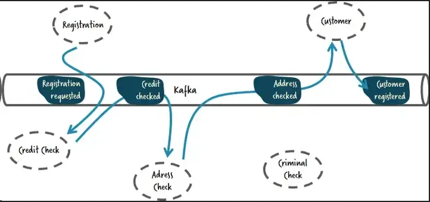
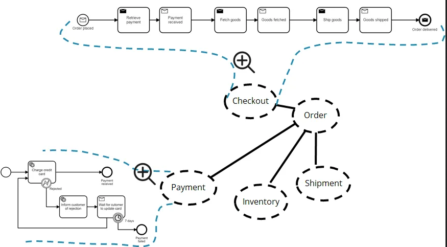
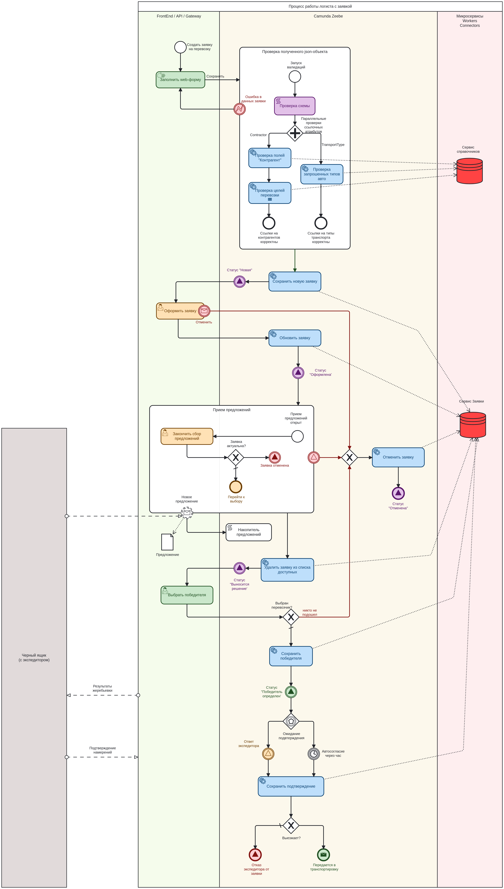
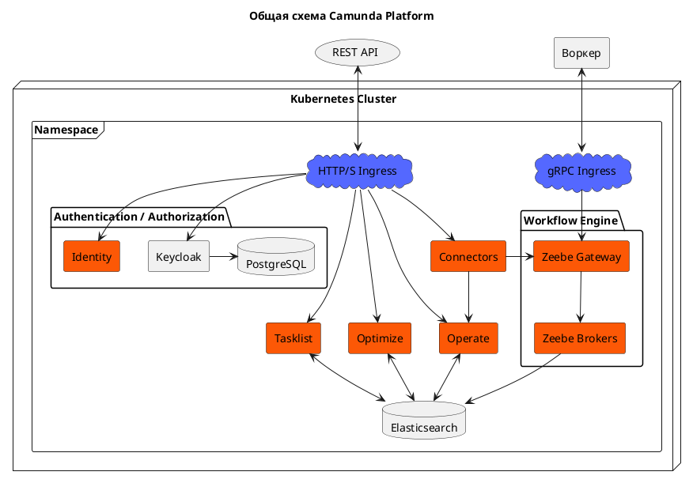
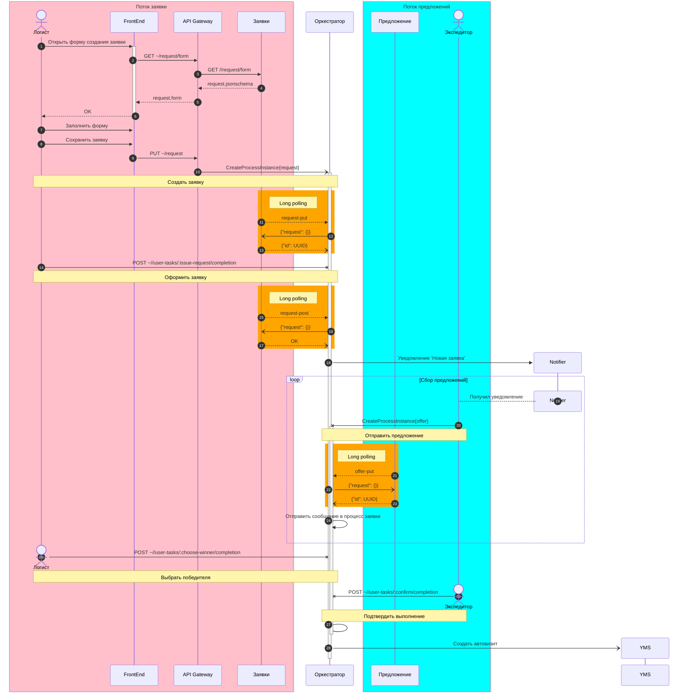

<iframe id="myEmbeddedDiagram" src="https://structurizr.moarse.ru/embed/2?diagram=yp-structure&iframe=myEmbeddedDiagram" width="100%" marginwidth="0" marginheight="0" frameborder="0" scrolling="no" allowfullscreen="true"></iframe>

## Принцип оркестрации
### Хореография 
 - Событийная связь
 - **Loose coupling**
 - Децентрализованное управление
 - Требует разработки четко определенных интерфейсов
 - Отсутствие контроля, сложность отладки

### Оркестрация  
- Командная связь
- Централизованное управление
- **Простота разработки и сопровождения**
- Tight coupling
- Одна точка отказа

## BPMN
### Условная схема оркестрации в портале

<iframe id="vague-diagram" src="https://structurizr.moarse.ru/embed/5?diagram=vague-bpmn&diagramSelector=false&iframe=vague-diagram" width="100%" marginwidth="0" marginheight="0" frameborder="0" scrolling="no" allowfullscreen="true"></iframe>

### Реалистичная схема процесса заявки 

## Архитектура оркестратора
### Компоненты 

 - **Zeebe** – движок
 - **Connectors** – точки интеграции 
 - **Tasklist** – выполнение пользовательских задач 
 - **Operate** – мониторинг процессов (техподдержка)
 - **Optimize** – оптимизация быстродействия
 - **Identity** – собственный слой безопасности и ролевая модель

### В ландшафте Solvo
<iframe id="camunda-comp" src="https://structurizr.moarse.ru/embed/5?diagram=camunda-arch&diagramSelector=false&iframe=camunda-comp" width="100%" marginwidth="0" marginheight="0" frameborder="0" scrolling="no" allowfullscreen="true"></iframe>

## Поток исполнения

