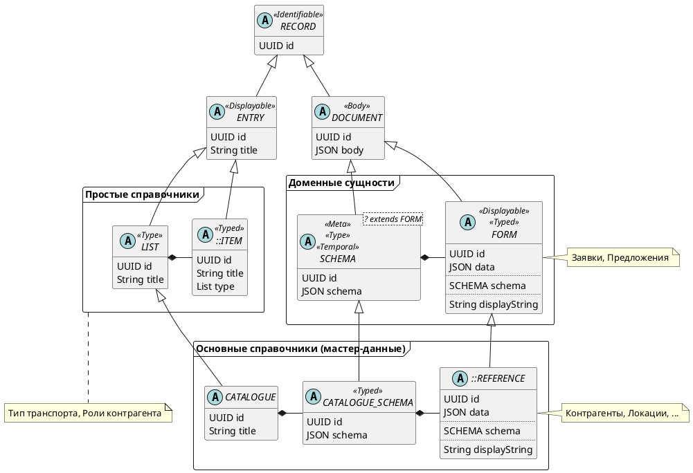
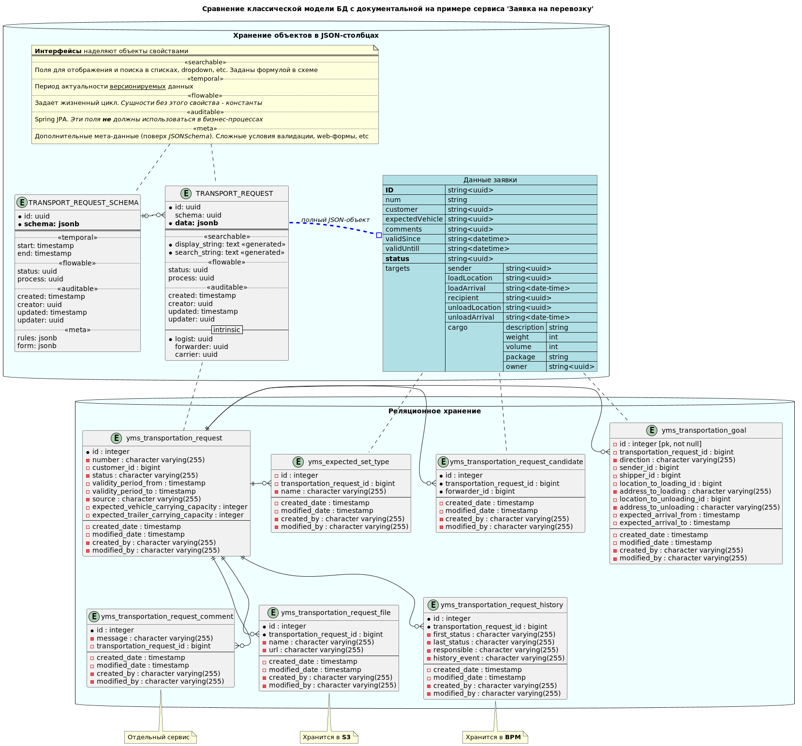
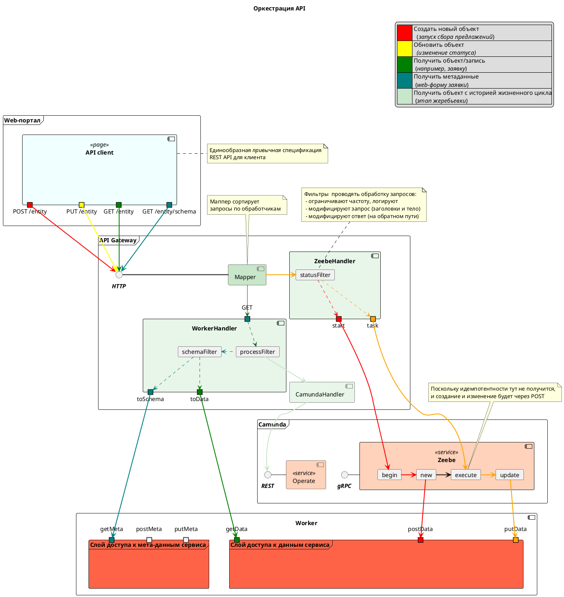

## Ключевые моменты

- Относиться к мета-данным как самим данными 

- Базовые мета-данные — атрибутивный состав

- Хранить мета-данные как ''*реестр реестров*" 

- Выделить примитивные реестры (списки)

- Выделить доменные сущности
### Абстрактная модель

### Реализация таблиц БД на примере Заявки на перевозку

## Оркестрация запросов

