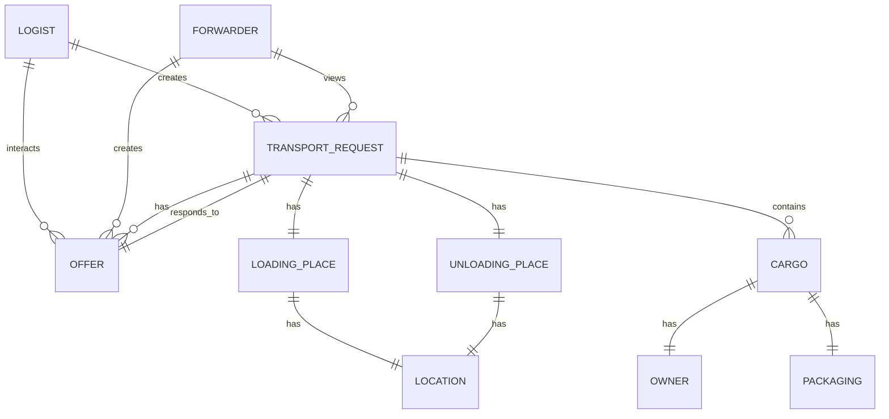

## Введение

Zeebe - это BPMN-движок с открытым исходным кодом, предназначенный для оркестровки микросервисных бизнес-процессов. Он использует gRPC (gRPC Remote Procedure Calls) для обеспечения высокопроизводительной и надежной коммуникации между своими компонентами, а также между Zeebe и клиентскими приложениями. 

### Безопасность gRPC-коммуникации

gRPC - это высокопроизводительный протокол RPC, основанный на HTTP/2. Он обеспечивает надежную и упорядоченную доставку сообщений, что делает его идеальным выбором для микросервисной архитектуры. 

**Однако, как и любой протокол передачи данных, gRPC необходимо защищать от различных угроз безопасности:**

* **Перехват данных:** Несанкционированные пользователи могут перехватывать и читать незашифрованные данные, передаваемые между Zeebe и клиентскими приложениями.
* **Вмешательство:** Несанкционированные пользователи могут изменять или удалять данные, передаваемые между Zeebe и клиентскими приложениями.
* **Отказ в обслуживании (DoS):** Несанкционированные пользователи могут перегружать Zeebe или клиентские приложения фейковыми запросами, делая их недоступными для легитимных пользователей.

```plantuml
Bob -> Alice : hello
```





### Каналы связи Zeebe

Zeebe использует несколько каналов связи для взаимодействия между своими компонентами и клиентскими приложениями:

* **gRPC over TCP:** Это канал связи по умолчанию для Zeebe. Он обеспечивает надежную и упорядоченную доставку сообщений, но не шифрует данные.
* **gRPC over TLS:** Это защищенный канал связи, который использует TLS (Transport Layer Security) для шифрования сообщений. TLS обеспечивает конфиденциальность и целостность данных, а также аутентификацию сервера.
* **In-memory:** Этот канал связи используется для связи между компонентами Zeebe, которые выполняются в одном процессе. Он не требует сетевой передачи данных и поэтому не подвержен сетевым атакам.

### Методы обеспечения безопасности gRPC-коммуникации:**

**1. Шифрование TLS:**

**Best Practice:**

* **gRPC over TLS для всех коммуникаций между Zeebe и клиентскими приложениями.** TLS шифрует данные, передаваемые между узлами, делая их нечитаемыми для несанкционированных пользователей.

**Пример:**

```
# В конфигурации Zeebe Gateway:
grpcGateway {
  port = 8080
  tls {
    enabled = true
    certificateFile = "/path/to/server.crt"
    privateKeyFile = "/path/to/server.key"
  }
}
```

**2. Аутентификация:**

**Best Practice:**

* ** X.509 для проверки подлинности пользователей и серверов.** Аутентификация X.509 использует цифровые сертификаты для подтверждения личности участников взаимодействия.


**Пример:**

```
# В конфигурации Zeebe Gateway:
grpcGateway {
  authentication {
    enabled = true
    type = x509
    caCertFile = "/path/to/ca.crt"
  }
}
```

**3. Авторизация:**

**Best Practice:**

* **RBAC для контроля доступа к ресурсам Zeebe.** RBAC позволяет назначать пользователям роли и разрешения, ограничивая их возможности в системе.
* **Определите четкие политики RBAC, соответствующие вашим бизнес-требованиям.**
* **Регулярно проверяйте и обновляйте политики RBAC.**
